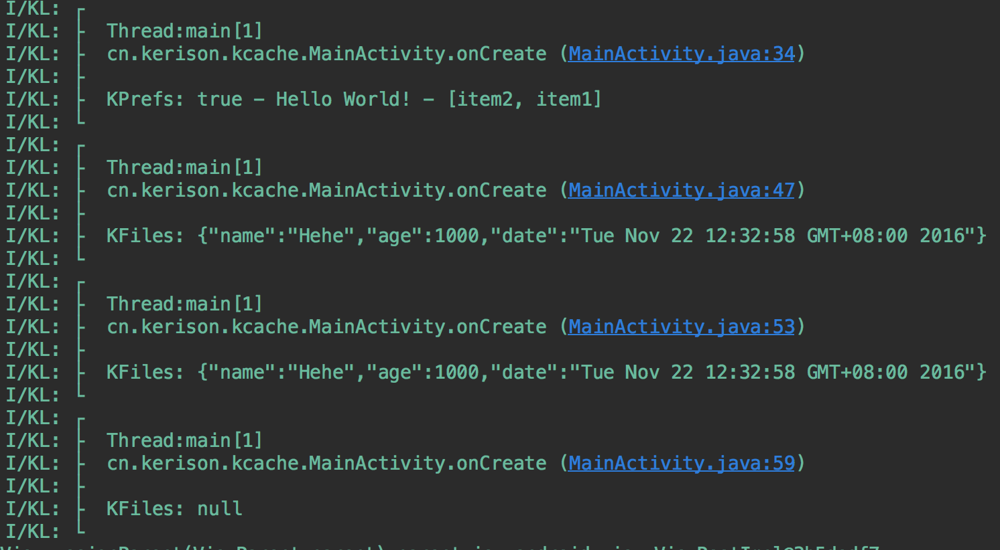

# KCache
Android中的数据缓存库，支持SharedPreference和File形式。
 
 - KPrefs使用XML方式，支持常用的数据类型保存，推荐保存用户的常用信息
 - KFiles使用File方式，支持String,JSON,Serializable的对象数据类型，推荐用来做数据或网络缓存，更为复杂的本地管理最好采用数据库等。

[](https://jitpack.io/#GKerison/KCache)

# 配置
- 增加仓库
```gradle
	allprojects {
		repositories {
			...
			maven { url "https://jitpack.io" }
		}
	}
```
- 增加依赖
```gradle
dependencies {
	        compile 'com.github.GKerison:KCache:1.0.0'
	}

```
# KPrefs
使用系统提供的SharedPreference来缓存常用的基本信息

	- init //使用前初始化配置信息
	- getPrefs //更自由使用
	- getEditor //数据编辑
	- getBoolean
	- getLong
	- getInt
	- getFloat
	- getString
	- getStringSet
	- hasSave
	- clear

# KFiles
使用File来管理数据的缓存，方便管理多种对象，切支持设置缓存时长

	- init
	- putString
	- getString
	- putJSONObject
	- getJSONObject
	- putJSONArray
	- getJSONArray
	- putObject
	- getObject
	- remove
	- clear

# 栗子
```java
	KPrefs.init(this);
    Set<String> data = new HashSet<>();
    data.add("item1");
    data.add("item2");
    KPrefs.getEditor()
            .putBoolean("yn", true)
            .putString("text","Hello World!")
            .putStringSet("textSet",data)
            .commit();

    KL.i("KPrefs: %s - %s - %s", KPrefs.getBoolean("yn"), KPrefs.getString("text"), KPrefs.getStringSet("textSet").toString());


    KFiles.init(this, "KCaches");
    JSONObject json = new JSONObject();
    try {
        json.put("name", "Hehe");
        json.put("age", 1000);
        json.put("date", new Date());
    } catch (JSONException e) {
        e.printStackTrace();
    }
    KFiles.putJSONObject("json", json, 5);
    KL.i("KFiles: %s", KFiles.getJSONObject("json")+"");
    try {
        Thread.sleep(3000);
    } catch (InterruptedException e) {
        e.printStackTrace();
    }
    KL.i("KFiles: %s", KFiles.getJSONObject("json")+"");
    try {
        Thread.sleep(2000);
    } catch (InterruptedException e) {
        e.printStackTrace();
    }
    KL.i("KFiles: %s", KFiles.getJSONObject("json")+"");
```

